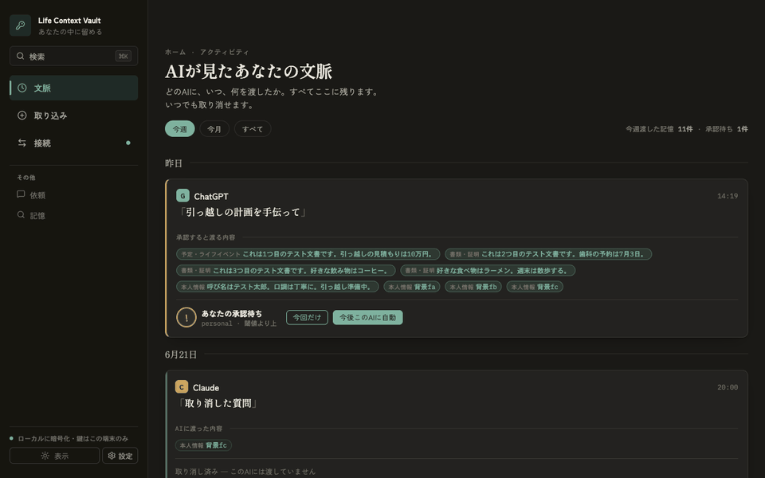

# Life Context Vault

**Give your AI the context to actually help you — without handing it your whole life.**

**[→ ランディングページ / Landing page](https://kota-ohno.github.io/life-context-vault/)**

Life Context Vault is a local-first desktop app that keeps a private, encrypted
vault of your personal life context and lets AI clients (Claude Desktop, ChatGPT,
Codex, …) request small, **reviewed Context Packs** — never the raw vault, never
your source documents, never anything you haven't approved.

The trust boundary *is* the product. Everything else is built to make that
boundary real, visible, and enforced in code.



## Why it exists

Useful AI needs context about you. The usual ways to give it that context are
bad trades: paste your life into a chat box and lose track of where it went, or
hand a model blanket access to your mail, files, and history and hope for the
best. Both leak far more than the task needed, and neither lets you see or take
back what was shared.

Life Context Vault makes the opposite trade:

- **You curate what goes in.** Manual notes, file uploads, and opt-in browser
  capture — deliberate by design. There is no background vacuum of your email,
  calendar, or browsing history.
- **The AI only ever sees a reviewed Context Pack.** For each request the app
  ranks relevant *approved facts*, shows you exactly what would be sent, and
  sends nothing until policy is satisfied (and, for reviewed packs, until you
  confirm).
- **Secrets can never leak.** Anything classified `secret_never_send` can never
  become an approved fact and can never enter a pack — enforced in code, not
  configuration.
- **You can see and undo everything.** Every source, candidate, request, pack,
  and delivery is in the audit trail. Packs expire (10-minute delivery window),
  and tightening policy or editing/hiding a fact retroactively invalidates packs.

## How the boundary works

```
RawSource → candidate (UNTRUSTED) → you approve → ApprovedFact (canonical)
                                                        │
                       audit ← Context Pack ← rank + filter ← (current policy)
                                     │
                       you confirm → AI client
```

The boundary is enforced **twice, in code**: a memory candidate only becomes an
approved fact through an explicit user action, and every Context Pack is
re-validated against current policy at retrieval time — not just when it was
built. The payload an AI receives narrows excluded items to a *reason* only; it
never learns *what* was withheld. The same core (`*_at_path` functions) backs
both the desktop app and the MCP sidecar, so the boundary lives in exactly one
place.

## What's under the hood

- **Local-first & encrypted.** State persists to a SQLCipher-encrypted SQLite
  database in your app-data directory, keyed by the OS secure credential store
  (macOS Keychain). The product makes no network egress of its own.
- **Sensitivity tiers & per-connection policy.** Facts are tiered (public →
  `secret_never_send`); each AI connection has a ceiling, a domain allowlist, and
  an opt-in "trust this AI" mode for lower-friction delivery of low-sensitivity
  context.
- **Product-grade retrieval.** Normalized SQLite projection tables plus native
  FTS, benchmarked at 100k facts / 500k chunks.
- **Open standards.** A local MCP stdio sidecar exposes a tiny, controlled tool
  surface to any same-device MCP client.

> Status: early (0.1.0). The trust boundary and its enforcement are implemented
> and covered by tests on both the Rust core and the TypeScript fallback; the
> product slice around it is still growing. Contributions welcome — see
> [CONTRIBUTING.md](CONTRIBUTING.md).

## Run as a desktop app

Life Context Vault is desktop-first. Use the Tauri app for AI access, encrypted
native persistence, and Local MCP.

```bash
npm install
npm run tauri:dev
```

Production binary (no bundling): `npm run tauri:build` · macOS `.app` bundle:
`npm run tauri:bundle`.

## Run the browser preview

Browser dev mode is for UI review and fallback (`localStorage`) storage only — no
encrypted persistence and no MCP.

```bash
npm run dev
```

## Connect a local AI client (MCP)

```bash
npm run mcp:build
```

Then open **Connections** in the desktop app and use **Claude設定へ追加** — it
merges the `life-context-vault` MCP server into Claude Desktop's config (backing
up the existing config first). Manual copy is available as a fallback.

The sidecar exposes a controlled tool surface only:

- `request_context_pack`
- `propose_memory`
- `get_policy_summary`
- `get_request_status`

See [`docs/local-mcp-sidecar.md`](docs/local-mcp-sidecar.md) for setup, the
safety boundary, and a stdio smoke test.

## Try it end to end

1. Open **Home** and add a small piece of life background.
2. Review the generated candidate in **Inbox** and save it as an approved fact.
3. Open **Requests** and prepare a Context Pack for a ChatGPT- or Claude-style
   task (use copy fallback if Local MCP isn't connected yet).
4. Open **Connections** to make the route persistent (Claude Desktop / local MCP
   or copy fallback).
5. Confirm exactly what will be AI-bound — or copy the pack for an AI that can't
   use MCP yet.
6. Open **Audit** to see what was saved, requested, generated, sent, or denied.

## Verify

The release gate — exactly what CI runs (frontend tests, type-check + build,
`cargo fmt --check`, `cargo test`, `cargo build --bins`, whitespace check):

```bash
npm run product:check
```

Add the bundled-sidecar integration and the large-retrieval benchmark (slower):

```bash
npm run product:check:full
```

## Learn more

- [CLAUDE.md](CLAUDE.md) — architecture, the trust boundary, and conventions.
- [SECURITY.md](SECURITY.md) — threat model and how to report a vulnerability.
- [`docs/`](docs/) — data model, product design, privacy policy, and data deletion.

## License

[MIT](LICENSE). The UI is Japanese-first.
