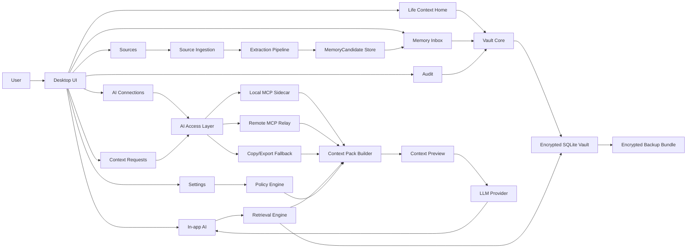

# Life Context Vault Architecture

Last updated: 2026-06-11

## Architecture Goal

Life Context Vault should be a local-first context system where the user owns the canonical Vault and everyday AI clients receive only reviewed, purpose-specific Context Packs.

The PoC architecture must support:

- Non-engineering users.
- Local-first ownership.
- Encrypted local storage and encrypted backup.
- Guided background onboarding, uploaded documents, manual notes, and in-app conversations as initial sources.
- Memory Inbox review before durable memory.
- Life Context Home with a user-editable Background Snapshot.
- Hybrid retrieval across text, vectors, entities, dates, sensitivity, and validity.
- AI access from first-party UI, local MCP clients, remote MCP relay clients, and copy/export fallback.
- Context Pack preview before sensitive or consequential context leaves the Vault boundary.

The product-grade direction starts with AI access as a first-class surface. The first-party app remains the trust and control surface, while MCP and relay adapters are constrained to Context Pack requests and memory proposals.

## Recommended Stack

Use this stack for the first implementation unless a later technical spike disproves it:

- Desktop shell: Tauri 2.x unless an implementation-time compatibility issue requires the current stable Tauri line.
- Frontend: React + Vite + TypeScript.
- Frontend state: local UI state in React; all Vault reads and writes go through typed Tauri commands, not direct database access from the webview.
- App core: Rust commands behind the Tauri bridge.
- Canonical store: SQLite.
- Full-text search: SQLite FTS5.
- Local vector search: sqlite-vec or an equivalent embedded SQLite vector extension.
- Local encryption: SQLCipher or an equivalent SQLite encryption layer.
- Key storage: OS secure storage such as macOS Keychain, Windows Credential Manager, or Linux Secret Service.
- Backup: encrypted Vault bundle, uploaded only after user opt-in.
- LLM: provider-pluggable, with no raw Vault-wide access.

Tauri is preferred because it can provide a desktop UX with local filesystem access, OS key storage integration, and a small native shell while keeping the UI stack web-based.

SQLite is preferred because the PoC needs inspectable local storage, transactional updates, full-text indexing, structured metadata filters, and simple backup semantics.

## System Components

### Desktop UI

The UI owns user-facing review, consent, and correction.

It includes:

- Life Context Home
- Memory Inbox
- Sources
- Ask
- Search
- Settings

The UI must never present AI-extracted content as truth until the user approves it.

### Vault Core

Vault Core owns:

- Data model enforcement.
- Candidate-to-fact transitions.
- Background Snapshot generation from approved facts and summaries.
- Source provenance links.
- Sensitivity policy.
- Audit log.
- Search index updates.
- Conflict detection.

Vault Core is the only component allowed to create ApprovedFact records.

### Source Ingestion

Source ingestion handles user-supplied background, conversations, notes, and files.

Initial supported input classes:

- Guided onboarding answers
- In-app conversation excerpts
- Manual notes
- PDF
- Image scans when OCR is available
- Plain text
- Markdown
- Common office documents if extraction support is available

The ingestion pipeline stores the original file, structured answer, conversation excerpt, or local file reference. It creates a RawSource record, extracts text or structured fields, then produces MemoryCandidate records.

### Extraction Pipeline

Extraction is allowed to use local parsers, OCR, local models, and cloud LLMs depending on policy.

Default PoC behavior:

- Extract raw text locally where possible.
- Detect document type, parties, dates, obligations, and sensitivity locally where feasible.
- Use LLMs for structured candidate generation only with minimal source excerpts or user-approved document access.
- Store LLM output as candidates, never as approved facts.

### Policy Engine

Policy Engine decides:

- Whether a source may be analyzed.
- Whether a candidate may be shown normally or needs sensitive review.
- Whether a fact may be retrieved for a task.
- Whether a Context Pack requires answer-time confirmation.
- Whether a context item may be sent to the configured LLM provider.

Policy decisions must be recorded in the audit log.

### Retrieval Engine

Retrieval Engine creates candidate context for a user task.

It performs:

1. Purpose and risk classification.
2. Sensitivity ceiling selection.
3. Keyword retrieval through FTS5.
4. Semantic retrieval through local vectors.
5. Entity, date, validity, source, and sensitivity filters.
6. Conflict and freshness checks.
7. Reranking and deduplication.
8. Context Pack assembly.

Retrieval must use only approved facts and allowed source snippets unless the user explicitly chooses otherwise.

### Context Pack Builder

Context Pack Builder converts retrieval results into an AI-bound payload.

It includes:

- User task.
- Retrieval timestamp.
- Stable background facts relevant to the task.
- Selected facts.
- Minimal source excerpts when needed.
- Sensitivity summary.
- Excluded context and exclusion reasons.
- Warnings about stale, conflicting, or low-confidence facts.
- User confirmation state.

The LLM provider receives the Context Pack, not the Vault.

### AI Access Layer

AI Access Layer is the only external-facing surface for everyday AI clients.

It supports three routes:

- Local MCP sidecar for same-device clients such as Claude Desktop and Codex-like tools.
- Remote MCP relay for hosted clients such as ChatGPT or Claude web/API connectors.
- Copy/export fallback for AI clients that cannot call tools.

Required behavior:

- External clients create `ContextPackRequest` records; they do not read the Vault directly.
- External clients may create `MemoryCandidate` proposals; they do not create `ApprovedFact` records.
- The relay never stores the full Vault or raw long-term Sources.
- Relay-held Context Packs are short lived. The default TTL is 10 minutes.
- Request, confirmation, denial, and fulfillment are recorded as audit events without storing unnecessary Pack body in relay logs.

Initial tool surface:

- `life_context.request_context_pack`
- `life_context.propose_memory`
- `life_context.get_policy_summary`
- `life_context.get_request_status`

No tool may expose `read_all_vault`, unrestricted raw source reads, or unapproved candidates as trusted memory.

### Passive Capture

Passive capture observes allowed AI chat surfaces and creates review candidates from local transcript fragments.

Required behavior:

- Capture is opt-in and visible while enabled.
- Raw transcript fragments have a default 14-day TTL.
- Captured fragments create `MemoryCandidate` records only.
- Fact creation still requires user approval in Memory Inbox.
- Pausing capture prevents writes.
- Sensitive and secret detections keep the conservative policy defaults from the normal ingestion pipeline.

### LLM Provider Adapter

Provider adapters are replaceable.

Each adapter must support:

- Explicit model name.
- Payload logging controls.
- Network-off failure behavior.
- Maximum context size.
- Redaction preflight.
- Provider-specific privacy notes in settings.

The adapter must not have database access.

## Storage Layout

Use a single encrypted SQLite database as the canonical store for the PoC.

Suggested logical groups:

- `sources`: uploaded documents, onboarding answers, manual notes, and conversation source records.
- `source_chunks`: extracted text chunks and source spans.
- `memory_candidates`: unapproved extracted candidates.
- `facts`: approved facts.
- `entities`: people, organizations, documents, policies, places, accounts, routines, goals, plans, and life events.
- `relationships`: typed links between entities and facts.
- `policies`: user-configured storage and retrieval rules.
- `context_packs`: generated packs and confirmation status.
- `audit_events`: append-only record of sensitive actions and policy decisions.
- `search_index`: FTS5 virtual tables.
- `vector_index`: sqlite-vec or equivalent vector tables.

Indexes are derived state. They may be rebuilt from canonical tables.

## Search And Retrieval Design

Search must be hybrid because life context queries often mix semantic intent with exact constraints.

Example:

> "What do I need to update before changing jobs?"

Relevant context may require:

- Stable background such as household, goals, routines, preferences, or constraints.
- Semantic match to employment changes.
- Exact match to active contracts.
- Date filters for current obligations.
- Sensitivity filters for benefits or health details.
- Entity filters for current employer or insurer.
- Validity checks to avoid expired facts.

### Retrieval Pipeline

1. Normalize the user task.
2. Classify task domain and risk.
3. Set default sensitivity ceiling.
4. Run FTS query over approved fact text and source chunk text.
5. Run vector query over fact embeddings and source chunk embeddings.
6. Merge results using reciprocal rank fusion or another deterministic reranking strategy.
7. Apply hard filters:
   - fact status is approved
   - fact is valid for the task date
   - sensitivity is allowed
   - policy permits provider exposure
   - source is not deleted
8. Add graph neighbors for selected entities when allowed.
9. Detect stale or conflicting facts.
10. Build a Context Pack.

Hard filters must run after retrieval and before LLM exposure.

### Source Snippets

Source snippets may be included only when:

- Needed to answer accurately.
- Policy permits their use.
- The snippet is minimal.
- Sensitive fields are redacted or confirmed by the user.

The system should prefer approved facts over long source excerpts.

## AI Processing Policy

The PoC uses a hybrid cautious model:

- Local storage and indexes are canonical.
- Raw Vault-wide export to LLMs is prohibited.
- LLM calls receive task-specific payloads.
- Sensitive or consequential context requires user preview.
- All candidate memories generated by AI require approval.

### Allowed LLM Uses

- Summarizing a user-selected document.
- Proposing MemoryCandidate records.
- Suggesting background profile updates from an in-app conversation.
- Generating a response from a user-confirmed Context Pack.
- Explaining why a candidate may matter.

### Disallowed LLM Uses

- Scanning the whole Vault without user task or policy.
- Writing ApprovedFact records directly.
- Sending Tier 4 secret material.
- Silently using sensitive context in an answer.
- Making autonomous life decisions or submitting forms.

## Encryption And Backup

### Local Encryption

The local database must be encrypted at rest.

Default approach:

- Generate a random Vault encryption key.
- Store the key in OS secure storage.
- Use SQLCipher or equivalent database encryption.
- Lock the Vault when the OS session locks if supported.

The app should never log the encryption key, database passphrase, raw document text, or Context Pack payload by default.

### Backup

Backup is opt-in.

Backup unit:

- Encrypted database file.
- Encrypted document blobs if stored outside the DB.
- Metadata manifest with non-sensitive version information.

Backup destination is outside the PoC decision. The first implementation may support local encrypted export before cloud backup.

Backup restore must verify:

- Vault version.
- Encryption compatibility.
- Manifest integrity.
- User authentication to retrieve the key or enter recovery material.

## Audit Log

Audit events are append-only.

Record events for:

- Source added or deleted.
- Candidate generated.
- Candidate approved, edited, rejected, or marked sensitive.
- Fact created, updated, expired, or deleted.
- Context Pack generated.
- Context Pack confirmed, edited, or cancelled.
- LLM payload sent.
- Policy changed.
- Backup created or restored.

The audit log should store metadata and references, not raw sensitive payloads.

## Failure Modes

### Network Unavailable

The app remains usable for:

- Viewing Vault contents.
- Searching local facts and sources.
- Reviewing existing candidates.
- Adding sources for local extraction if supported.

LLM-dependent candidate generation and in-app AI answers show a clear offline state.

### Extraction Failed

The source remains stored.

The Sources view shows:

- Extraction failed.
- Error category.
- Retry action.
- Manual note option.

No candidate facts are created from failed extraction.

### LLM Refuses Or Fails

The app shows:

- Provider failure.
- No Vault data was changed.
- Retry option.

Failed LLM output must not create candidates.

### Conflicting Facts

New conflicting extraction creates conflict candidates.

Approved facts are not overwritten without user action.

### Backup Failed

The app keeps local operation unaffected and shows backup status.

Backup failure must not block local Vault access.

## Future MCP Adapter

MCP is a later integration surface, not the first product.

When added, MCP should expose only controlled tools:

- `search_context`
- `build_context_pack`
- `list_context_pack_items`
- `propose_memory_candidate`
- `get_audit_summary`

Do not expose:

- Raw Vault dump.
- Direct ApprovedFact writes.
- Tier 3 sensitive reads without first-party app confirmation.
- Tier 4 material.

MCP clients should receive Context Packs, not unrestricted database access.

## Implementation Milestones

### Milestone 1: Local Vault Skeleton

- Tauri desktop shell.
- Encrypted SQLite database.
- Basic sources table.
- Life Context Home shell.
- Manual source import.
- Memory Inbox shell.
- Audit log.

### Milestone 2: Candidate Extraction

- Local text extraction.
- Guided background onboarding.
- Candidate schema.
- Candidate review actions.
- ApprovedFact creation.
- Sensitivity labels.

### Milestone 3: Search And Context Pack

- FTS5 search.
- Entity/date/sensitivity filters.
- Context Pack builder.
- Context preview UI.

### Milestone 4: In-App AI

- Provider adapter.
- Context Pack confirmation.
- Answer generation.
- Used-context footer.

### Milestone 5: Backup And Restore

- Encrypted export.
- Restore validation.
- Backup status UI.

Vector search can be introduced in Milestone 3 or 4 depending on extraction and embedding readiness. FTS5 plus metadata filters are sufficient for the first vertical slice.

## Verification Checklist

Architecture is acceptable only if:

- The Vault remains useful offline.
- The LLM provider cannot access the database directly.
- Approved facts can be traced to sources.
- Candidate memories cannot be used as canonical facts.
- Search can filter by sensitivity, validity, source, and entity.
- Context Packs are visible before sensitive or consequential LLM use.
- Tier 4 material is never sent to the LLM.
- Backup cannot expose plaintext Vault contents.
- Indexes can be rebuilt from canonical data.

## References

- [Product design](./life-context-vault-product-design.md)
- [Data model](./life-context-vault-data-model.md)
- [Deep research memo](./deep-research-life-context-vault-2026-06-11.md)
- [Tauri](https://v2.tauri.app/)
- [SQLite FTS5](https://sqlite.org/fts5.html)
- [sqlite-vec](https://alexgarcia.xyz/sqlite-vec/)
- [SQLCipher](https://www.zetetic.net/sqlcipher/)
- [MCP specification](https://modelcontextprotocol.io/specification/2025-06-18)
- [OWASP Top 10 for LLM Applications](https://owasp.org/www-project-top-10-for-large-language-model-applications/)
