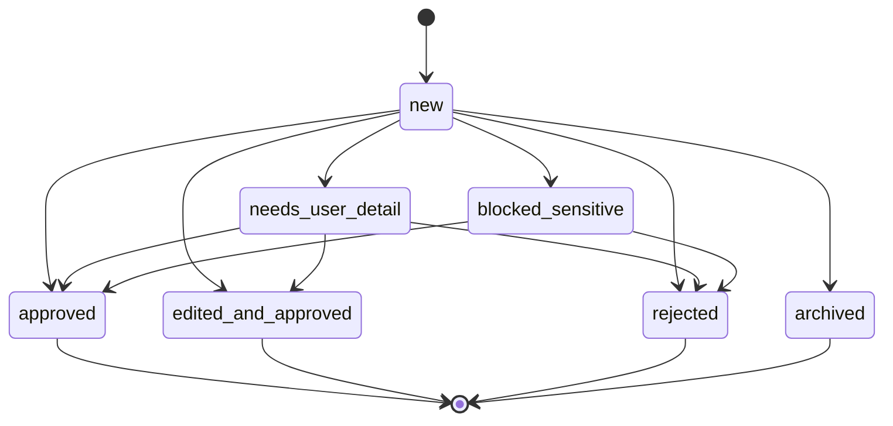
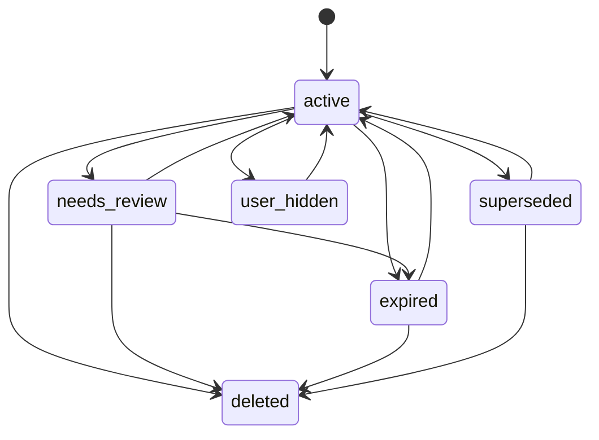

# Life Context Vault Data Model

Last updated: 2026-06-12

## Data Model Goals

The data model must make trust boundaries explicit.

Core rules:

- Raw sources are evidence, not memories.
- AI extraction creates candidates, not truth.
- Only user-approved facts are canonical context.
- Context Packs are the only AI-bound representation of Vault context.
- Sensitivity and policy checks are first-class fields, not UI-only labels.
- Deletion, correction, expiration, and conflict handling must be represented directly.

This document defines conceptual types. The first implementation may map them to SQLite tables and TypeScript/Rust types, but it should preserve the semantics and state transitions here.

## Naming Conventions

- Use globally unique IDs with stable prefixes.
- Store timestamps in ISO 8601 UTC.
- Store dates without times for real-world document dates when the time is irrelevant.
- Store source spans when a fact is derived from a specific part of a document.
- Store user-facing text separately from machine labels when needed.

Suggested prefixes:

- `src_`: RawSource
- `chunk_`: SourceChunk
- `cand_`: MemoryCandidate
- `fact_`: ApprovedFact
- `ent_`: Entity
- `rel_`: Relationship
- `policy_`: Policy
- `pack_`: ContextPack
- `audit_`: AuditEvent

## Sensitivity Tiers

Sensitivity is a required field for candidates, facts, source chunks, and context items.

| Tier | Code | Name | Default Policy |
| --- | --- | --- | --- |
| 0 | `public` | Public or harmless preference | Can be saved after lightweight review |
| 1 | `personal` | Personal ordinary | Requires approval before use as fact |
| 2 | `private_consequential` | Private consequential | Requires explicit approval and answer-time visibility |
| 3 | `sensitive` | Sensitive personal context | Requires explicit storage approval and explicit use approval |
| 4 | `secret_never_send` | Secret or never-send | Must not be saved as ordinary memory or sent to LLM |

```ts
type SensitivityTier =
  | "public"
  | "personal"
  | "private_consequential"
  | "sensitive"
  | "secret_never_send";
```

Examples of Tier 3:

- Health
- Disability
- Benefits
- Care needs
- Legal matters
- Detailed financial hardship
- Biometrics
- Minor-related information
- Intimate relationships

Examples of Tier 4:

- Passwords
- API tokens
- Private keys
- Full national ID numbers
- Full bank account numbers
- Recovery codes

Tier 4 detections may be recorded as redacted audit events, but the secret value itself must not be stored in ordinary fact or candidate text.

## Canonical Object Types

### RawSource

RawSource represents evidence supplied by the user or created inside the app.

RawSource is not itself a fact. It may support facts.

```ts
type RawSource = {
  id: string;
  kind:
    | "document"
    | "conversation"
    | "manual_note"
    | "background_onboarding"
    | "passive_capture"
    | "mcp_proposal";
  title: string;
  origin:
    | "user_upload"
    | "in_app_chat"
    | "manual_entry"
    | "guided_onboarding"
    | "passive_browser"
    | "local_mcp"
    | "remote_relay";
  file_ref?: string;
  content_hash?: string;
  mime_type?: string;
  language?: string;
  created_at: string;
  captured_at: string;
  retention_until?: string;
  promoted_to_long_term?: boolean;
  source_date?: string;
  user_description?: string;
  default_sensitivity: SensitivityTier;
  processing_status: "pending" | "extracting" | "ready" | "failed" | "deleted";
  deletion_state: "active" | "soft_deleted" | "purged";
};
```

Required behavior:

- Uploaded files create RawSource records before extraction.
- Deleting a RawSource must remove or disable linked source chunks.
- Facts derived from deleted sources must be marked as needing review unless the user explicitly keeps them.
- Material updates to Source title, default sensitivity, or retention metadata require a user action, a `source_updated` audit event, search/projection refresh, and invalidation of existing Context Packs that include facts linked to the Source.
- Material updates to Source body require a user action, fresh secret redaction, pending-candidate archival, MemoryCandidate re-extraction, linked active Facts marked `needs_review` with `source_updated`, and invalidation of existing Context Packs that include facts linked to the Source.
- RawSource body re-extraction must never update or create ApprovedFacts automatically; the user must approve new candidates or keep reviewed Facts explicitly.
- Source titles may be included in Context Packs only when the Source is active, allowed by sensitivity policy, and not `secret_never_send`.

### SourceChunk

SourceChunk is an extracted piece of a RawSource used for search, snippets, and provenance.

```ts
type SourceChunk = {
  id: string;
  source_id: string;
  chunk_index: number;
  text: string;
  page?: number;
  span_start?: number;
  span_end?: number;
  detected_sensitivity: SensitivityTier;
  embedding_status: "not_required" | "pending" | "ready" | "failed";
  created_at: string;
};
```

Required behavior:

- SourceChunk text may be indexed locally.
- SourceChunk text must not be sent to LLMs unless policy permits and the Context Pack requires it.
- Tier 4 chunks must be redacted or excluded from LLM-bound contexts.

### MemoryCandidate

MemoryCandidate is an AI- or parser-generated proposal.

It is not canonical context.

```ts
type MemoryCandidate = {
  id: string;
  source_ids: string[];
  source_chunk_ids: string[];
  proposed_fact_text: string;
  structured_value?: Record<string, unknown>;
  domain: LifeContextDomain;
  candidate_type:
    | "fact"
    | "deadline"
    | "obligation"
    | "contact_point"
    | "preference"
    | "goal"
    | "routine"
    | "constraint"
    | "life_event"
    | "relationship"
    | "background_profile"
    | "conflict"
    | "reminder_candidate";
  detected_sensitivity: SensitivityTier;
  confidence: "low" | "medium" | "high";
  reason_to_remember: string;
  valid_from?: string;
  valid_until?: string;
  due_date?: string;
  status:
    | "new"
    | "needs_user_detail"
    | "approved"
    | "edited_and_approved"
    | "rejected"
    | "archived"
    | "blocked_sensitive";
  created_at: string;
  reviewed_at?: string;
  reviewed_by?: "user";
  creates_fact_ids: string[];
  conflict_with_fact_ids: string[];
  conflict_reason?: string;
};
```

Required behavior:

- Candidates cannot be retrieved as approved context.
- Candidates may appear in Memory Inbox and conflict review.
- Approval creates one or more ApprovedFact records.
- Rejection does not delete the RawSource; it records the user's memory decision.
- Tier 3 candidates default to `blocked_sensitive` until the user opens a sensitive review flow.
- Tier 4 candidates must be redacted and cannot create ordinary facts containing the secret value.
- Candidates may carry `conflict_with_fact_ids` and `conflict_reason` when they conservatively disagree with active ApprovedFacts.
- Conflict metadata is advisory review pressure only. A conflicting candidate remains unapproved, cannot enter Context Packs, and must not overwrite or supersede a Fact unless the user explicitly approves a replacement.

### ApprovedFact

ApprovedFact is the canonical memory unit.

Only user action can create or materially update an ApprovedFact.

```ts
type ApprovedFact = {
  id: string;
  fact_text: string;
  structured_value?: Record<string, unknown>;
  domain: LifeContextDomain;
  fact_type:
    | "identity"
    | "document_reference"
    | "deadline"
    | "obligation"
    | "contract_term"
    | "contact_point"
    | "preference"
    | "relationship"
    | "life_event"
    | "goal"
    | "routine"
    | "constraint"
    | "support_need"
    | "place_context"
    | "background_profile"
    | "note";
  source_ids: string[];
  source_chunk_ids: string[];
  entity_ids: string[];
  sensitivity: SensitivityTier;
  confidence: "user_asserted" | "source_backed" | "inferred_and_confirmed";
  status:
    | "active"
    | "superseded"
    | "expired"
    | "needs_review"
    | "user_hidden"
    | "deleted";
  valid_from?: string;
  valid_until?: string;
  due_date?: string;
  created_at: string;
  approved_at: string;
  updated_at: string;
  approved_by: "user";
  supersedes_fact_ids: string[];
  superseded_by_fact_id?: string;
  retrieval_policy_id?: string;
};
```

Required behavior:

- ApprovedFact records are the default retrieval target.
- Facts must preserve source links where available.
- Facts may be user asserted without a document source, but confidence must say so.
- Facts with `status != active` are excluded from default retrieval.
- Expired facts may be shown as historical context only when relevant and clearly labeled.
- `user_hidden` facts are not retrieved unless the user explicitly includes them.
- Deleting a fact does not require deleting the source, but retrieval must exclude deleted facts.
- Material updates to fact text, domain, sensitivity, or date metadata require a user action, a `fact_updated` audit event, `updated_at` refresh, search-index refresh, and invalidation of existing Context Packs that include the fact.
- Candidate approval may supersede selected active facts. The new fact records `supersedes_fact_ids`, each old fact moves to `superseded` with `superseded_by_fact_id`, and Context Packs containing old facts are invalidated.

### Entity

Entity represents a durable thing the Vault can link facts to.

```ts
type Entity = {
  id: string;
  entity_type:
    | "person"
    | "organization"
    | "document"
    | "policy"
    | "contract"
    | "place"
    | "account_reference"
    | "routine"
    | "goal"
    | "plan"
    | "life_event"
    | "procedure"
    | "topic";
  display_name: string;
  aliases: string[];
  sensitivity: SensitivityTier;
  created_at: string;
  updated_at: string;
  status: "active" | "merged" | "hidden" | "deleted";
  merged_into_entity_id?: string;
};
```

Required behavior:

- Entities support retrieval filters and graph expansion.
- Entity extraction may be automatic, but entity use in high-sensitivity contexts follows linked fact sensitivity.
- Duplicate entity merging must not merge conflicting facts silently.

### Relationship

Relationship links entities and facts.

```ts
type Relationship = {
  id: string;
  from_entity_id: string;
  to_entity_id?: string;
  fact_id?: string;
  relation_type:
    | "mentions"
    | "issued_by"
    | "owned_by"
    | "applies_to"
    | "requires"
    | "renews_on"
    | "contact_for"
    | "supersedes"
    | "related_to";
  source_ids: string[];
  sensitivity: SensitivityTier;
  confidence: "low" | "medium" | "high" | "user_confirmed";
  created_at: string;
  status: "active" | "needs_review" | "deleted";
};
```

Required behavior:

- Relationships help retrieval but do not create facts by themselves.
- Relationship sensitivity is at least the maximum sensitivity of linked facts and entities.

### Summary

Summary is a derived view used for UX and retrieval efficiency.

```ts
type Summary = {
  id: string;
  summary_type:
    | "background_snapshot"
    | "source_summary"
    | "entity_summary"
    | "domain_summary"
    | "task_summary";
  text: string;
  source_ids: string[];
  fact_ids: string[];
  generated_by: "local" | "llm";
  sensitivity: SensitivityTier;
  status: "active" | "stale" | "deleted";
  created_at: string;
  updated_at: string;
};
```

Required behavior:

- Summaries are derived state.
- `background_snapshot` is the plain-language life model shown on Life Context Home.
- Summaries must be invalidated when key supporting facts change.
- Summaries do not replace facts as canonical truth.

### Policy

Policy controls storage, retrieval, and LLM exposure.

```ts
type Policy = {
  id: string;
  name: string;
  scope:
    | "global"
    | "domain"
    | "sensitivity"
    | "source"
    | "provider"
    | "task";
  rule_type:
    | "allow_save"
    | "require_save_confirmation"
    | "allow_retrieve"
    | "require_context_preview"
    | "allow_llm_send"
    | "deny_llm_send"
    | "never_store";
  selector: Record<string, unknown>;
  effect: "allow" | "deny" | "require_confirmation";
  priority: number;
  created_at: string;
  updated_at: string;
  enabled: boolean;
};
```

Default policies:

- Tier 0 may be saved after lightweight review.
- Tier 1 requires user approval before becoming fact.
- Tier 2 requires explicit approval and Context Pack visibility before LLM use.
- Tier 3 requires explicit storage approval and explicit use approval.
- Tier 4 is never stored as ordinary memory and never sent to LLM.

Deny rules override allow rules.

### ContextPack

ContextPack is the only normal representation sent to an AI provider.

```ts
type ContextPack = {
  id: string;
  task_text: string;
  task_domain: LifeContextDomain | "mixed" | "unknown";
  risk_level: "low" | "medium" | "high";
  generated_at: string;
  max_sensitivity_included: SensitivityTier;
  provider_id?: string;
  model_id?: string;
  items: ContextPackItem[];
  excluded_items: ContextExclusion[];
  warnings: ContextWarning[];
  confirmation_status:
    | "not_required"
    | "pending_user_confirmation"
    | "confirmed"
    | "edited_by_user"
    | "cancelled";
  confirmed_at?: string;
  llm_sent_at?: string;
};
```

```ts
type ContextPackItem = {
  id: string;
  fact_id?: string;
  source_chunk_id?: string;
  item_text: string;
  reason_included: string;
  sensitivity: SensitivityTier;
  source_titles: string[];
  source_dates: string[];
  valid_from?: string;
  valid_until?: string;
  confidence: "user_asserted" | "source_backed" | "inferred_and_confirmed";
};
```

```ts
type ContextExclusion = {
  referenced_id: string;
  referenced_type: "fact" | "source_chunk" | "candidate";
  reason:
    | "sensitivity_policy"
    | "provider_policy"
    | "expired"
    | "deleted"
    | "user_hidden"
    | "not_relevant"
    | "secret_never_send";
};
```

```ts
type ContextWarning = {
  kind:
    | "stale_fact"
    | "conflicting_facts"
    | "low_confidence"
    | "sensitive_context"
    | "source_deleted"
    | "policy_limited";
  message: string;
  related_ids: string[];
};
```

Required behavior:

- Context Packs are generated per task.
- Context Packs are auditable.
- Context Packs include excluded items when useful for transparency, but never include Tier 4 secret values.
- Context Packs with Tier 2 or Tier 3 items require user confirmation before LLM send.
- Context Packs may be edited by the user before sending.
- If edited, only the edited pack is sent.
- User-removed items must remain visible as `excluded_items` with reason `user_hidden`.
- Editing a Context Pack must recalculate `items`, `source_snippets`, `warnings`, and `max_sensitivity_included`, clear any previous confirmation timestamp, and write a `context_pack_updated` audit event.

### AuditEvent

AuditEvent records important actions and policy decisions.

```ts
type AuditEvent = {
  id: string;
  event_type:
    | "source_added"
    | "source_deleted"
    | "candidate_generated"
    | "candidate_reviewed"
    | "fact_created"
    | "fact_updated"
    | "fact_deleted"
    | "policy_changed"
    | "context_pack_generated"
    | "context_pack_updated"
    | "context_pack_confirmed"
    | "context_pack_delivered"
    | "context_pack_denied"
    | "llm_payload_sent"
    | "backup_created"
    | "restore_completed";
  actor: "user" | "system" | "llm" | "provider";
  subject_type:
    | "source"
    | "candidate"
    | "fact"
    | "policy"
    | "context_pack"
    | "backup"
    | "vault";
  subject_id: string;
  occurred_at: string;
  sensitivity: SensitivityTier;
  metadata: Record<string, unknown>;
};
```

Required behavior:

- Audit metadata must not contain raw secret values.
- `context_pack_delivered` records AI client, delivery channel, status, sensitivity ceiling, and item/snippet/exclusion counts only. It must not store Context Pack body text, Raw Source body text, or unapproved MemoryCandidate text.
- LLM payload events record provider, model, Context Pack ID, and payload size, not raw prompt text by default.
- Policy decisions for sensitive context must be auditable.

## Domain Enum

Use this first domain set:

```ts
type LifeContextDomain =
  | "identity_and_profile"
  | "values_goals_and_preferences"
  | "life_events_and_plans"
  | "routines_and_logistics"
  | "home_and_places"
  | "documents_and_evidence"
  | "contracts_and_policies"
  | "procedures_and_obligations"
  | "health_and_care"
  | "finance_and_benefits"
  | "work_and_education"
  | "relationships_and_household"
  | "constraints_and_accessibility";
```

## State Transitions

### Candidate To Fact



Creation rules:

- `approved` creates an ApprovedFact using proposed content.
- `edited_and_approved` creates an ApprovedFact using user-edited content.
- `blocked_sensitive` cannot create a fact without explicit sensitive approval.
- `rejected` and `archived` create no facts.

### Fact Lifecycle



Retrieval defaults:

- Include: `active`
- Exclude unless explicitly requested: `needs_review`, `expired`, `superseded`, `user_hidden`
- Always exclude: `deleted`
- Hiding, deleting, or moving an active Fact to `needs_review` must invalidate existing ContextPacks that include that Fact.
- Editing active Fact text, domain, sensitivity, validity, or due-date metadata must also invalidate existing ContextPacks that include that Fact.
- Superseding an active Fact must invalidate existing ContextPacks that include the old Fact and must not remove the old Fact from history.
- Keeping a `needs_review` Fact returns it to `active`, but does not resurrect previously invalidated ContextPacks.

## Conflict Model

Conflict detection creates MemoryCandidate records of type `conflict` or annotates ordinary MemoryCandidates with `conflict_with_fact_ids` and `conflict_reason`.

A conflict exists when a new source or candidate materially disagrees with an active fact about:

- Due date
- Renewal date
- Current provider
- Current address or contact point
- Active contract or policy status
- Eligibility or benefit status
- Required procedure

Deterministic conflict detection may use conservative current-value anchors for current address, provider, employer, phone, and email. These markers only annotate MemoryCandidates and must not rewrite, hide, or supersede ApprovedFacts without an explicit user review action.

Conflict resolution options:

- Keep existing fact.
- Approve new fact and mark old fact as superseded.
- Keep both with different validity dates.
- Mark both as needs_review.
- Reject the new candidate.

No automatic overwrite is allowed.

The first implementation may use conservative deterministic rules, such as same domain, different detected date, and overlapping key terms. False negatives are acceptable early; false positives must remain safe because they only create review prompts, not facts.

## Deletion And Forgetting

Users can delete:

- RawSource
- MemoryCandidate decision history
- ApprovedFact
- Entity
- ContextPack history

PoC deletion semantics:

- Soft delete first for recoverability.
- Exclude deleted items from retrieval immediately.
- Provide purge later for permanent deletion.
- Deleting a RawSource does not automatically delete approved facts, but linked facts become `needs_review` unless user chooses to keep them.
- Deleting or purging a RawSource must invalidate existing ContextPacks that include facts linked to that Source.
- Updating RawSource title, default sensitivity, or retention metadata must invalidate existing ContextPacks that include facts linked to that Source.
- Updating RawSource body must archive pending candidates from the previous body, create fresh MemoryCandidates only, mark linked active Facts as `needs_review`, and invalidate existing ContextPacks that include those Facts.
- Deleting an ApprovedFact does not delete the source.

Tier 4 values detected during extraction should be redacted before ordinary persistence where possible.

## SQLite Mapping

Initial SQLite mapping should use:

- Normal tables for canonical records.
- JSON columns for flexible structured values and selectors.
- FTS5 virtual tables for searchable text.
- Vector extension tables for embeddings.
- Join tables for many-to-many source, chunk, fact, and entity links.
- Append-only audit table.

Recommended canonical tables:

- `raw_sources`
- `source_chunks`
- `memory_candidates`
- `approved_facts`
- `entities`
- `relationships`
- `summaries`
- `policies`
- `context_packs`
- `context_pack_items`
- `context_exclusions`
- `audit_events`

Recommended join tables:

- `candidate_sources`
- `candidate_chunks`
- `fact_sources`
- `fact_chunks`
- `fact_entities`

Recommended derived tables:

- `source_chunks_fts`
- `approved_facts_fts`
- `source_chunk_embeddings`
- `approved_fact_embeddings`

Derived tables must be rebuildable.

## Retrieval Rules

Default retrieval includes only:

- ApprovedFact records.
- `status = active`.
- Sensitivity allowed by task, provider, and policy.
- Facts valid for the task date.
- Facts with non-deleted sources or user-asserted confidence.

Default retrieval excludes:

- MemoryCandidate records.
- Deleted facts.
- User-hidden facts.
- Tier 4 values.
- Source chunks without policy permission.
- Facts that require review.

Context Pack generation may mention exclusions by category, but not expose secret content.

## Validation Checklist

The data model is acceptable only if:

- It is impossible to confuse a MemoryCandidate with an ApprovedFact.
- ApprovedFact records always carry sensitivity and provenance fields.
- Context Packs are task-scoped and confirmation-aware.
- Tier 4 material has a no-send representation.
- Deleted and hidden facts are excluded by default.
- Conflicts can be represented without overwriting.
- Search indexes can be rebuilt from canonical records.
- Audit events can explain why sensitive context was or was not used.

## References

- [Product design](./life-context-vault-product-design.md)
- [Architecture](./life-context-vault-architecture.md)
- [Deep research memo](./deep-research-life-context-vault-2026-06-11.md)
- [Personal AI context research](./research-personal-ai-context-2026-06-11.md)
- [SQLite FTS5](https://sqlite.org/fts5.html)
- [sqlite-vec](https://alexgarcia.xyz/sqlite-vec/)
- [MCP specification](https://modelcontextprotocol.io/specification/2025-06-18)
